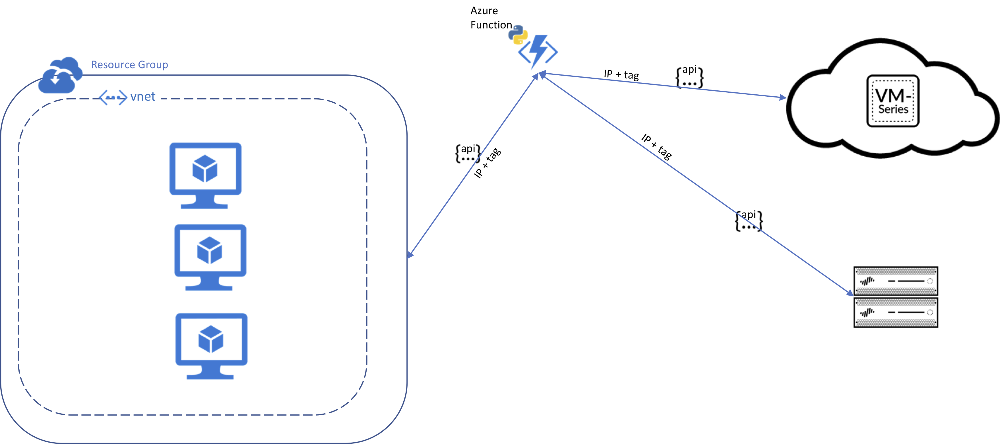

# azure-vm-monitoring

# Introduction
The dynamic nature of cloud environments means security also needs to be dynamic. Plao Alto Networks firewalls allow for the creation of dynamic address groups which can be programatically updated via APIs to reflect the changes in your cloud environment.
This automation is key in keeping up with the dynamic cloud environment.

Also when writing firewall security policies to secure assests deployed in Azure, it makes sense to write policies that are logical.

For example: Allow traffic from web-server running linux to db-server running windows

This can be accomplished by harvesting ip and tag information from various cloud resources and making them available in the firewall.

The harvested ip and tags information can then be used in Dynamic Address Groups to create dynamic security policies. 
As workloads are added or removed from the Azure Resource Group, the policy is dynamically updated.

# The solution

The published solution uses an Azure Function and harvest tags and associated IP addresses of VMs from specified Azure resource groups and pushes them to one or more firewalls.

Deployment guide can be found [here](https://github.com/PaloAltoNetworks/azure-vm-monitoring/blob/master/Azure%20VM%20Monitoring%20Setup%20Instructions.pdf)

Support: Community Supported
--------
Unless otherwise noted, these templates are released under an as-is, best effort, support policy. These scripts should be seen as community supported and Palo Alto Networks will contribute our expertise as and when possible. We do not provide technical support or help in using or troubleshooting the components of the project through our normal support options such as Palo Alto Networks support teams, or ASC (Authorized Support Centers) partners and backline support options. The underlying product used (the VM-Series firewall) by the scripts or templates are still supported, but the support is only for the product functionality and not for help in deploying or using the template or script itself. Unless explicitly tagged, all projects or work posted in our GitHub repository (at https://github.com/PaloAltoNetworks) or sites other than our official Downloads page on https://support.paloaltonetworks.com are provided under a community supported, best effort, policy.
